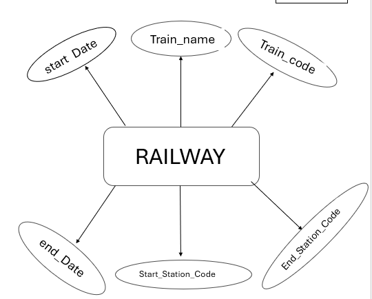
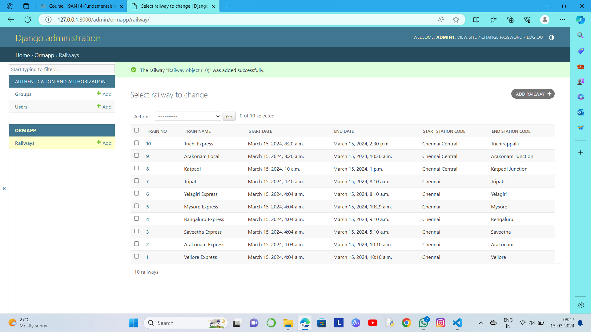

# Ex02 Django ORM Web Application
## Date: 
15/03/2024
## AIM
To develop a Django application to store and retrieve data from a Railway database using Object Relational Mapping(ORM).

## Entity Relationship Diagram

## DESIGN STEPS

### STEP 1:
Clone the problem from GitHub

### STEP 2:
Create a new app in Django project

### STEP 3:
Enter the code for admin.py and models.py

### STEP 4:
Execute Django admin and create details for 10 books

## PROGRAM
### models.py
~~~
from django.db import models
from django.contrib import admin
class Railway(models.Model):
    Train_code=models.IntegerField(primary_key=True)
    Train_Name=models.CharField(max_length=100)
    start_Date=models.DateTimeField()
    end_Date=models.DateTimeField()
    Start_Station_Code=models.CharField(max_length=20)
    End_Station_Code=models.CharField(max_length=20)
    
class RailwayAdmin(admin.ModelAdmin):
    list_display=('Train_code','Train_Name','start_Date','end_Date','Start_Station_Code','End_Station_Code')
~~~
### admin.py
~~~
from django.contrib import admin
from .models import Railway,RailwayAdmin
admin.site.register(Railway,RailwayAdmin)
~~~
## OUTPUT

## RESULT
Thus the program for creating a database using ORM hass been executed successfully
